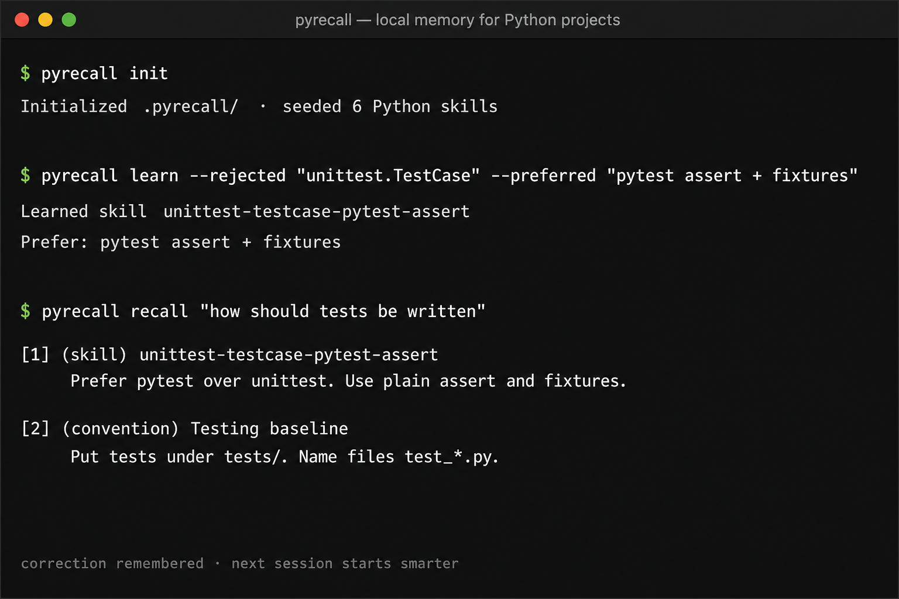

# PyRecall

[](https://github.com/mjpt1/pyrecall/actions/workflows/ci.yml)
[](https://pypi.org/project/py-recall/)

Local project memory and correction learning for Python workflows.

<p align="center">
  
</p>

PyRecall keeps durable notes about your repository, turns corrections into reusable skills, and serves them back through a CLI or a stdio tool bridge that compatible coding tools can call.

No cloud account. No network calls for recall. Everything stays in `.pyrecall/` inside your project.

Replay the same session locally:

```bash
# Unix
bash examples/demo.sh

# Windows PowerShell
./examples/demo.ps1
```

## Why

Coding tools forget project preferences between sessions. You correct the same mistake twice. PyRecall records the correction once and surfaces it the next time the same topic comes up — especially for Python testing, typing, packaging, and style conventions.

## Install

```bash
pip install py-recall
```

This installs the `pyrecall` command and the `pyrecall` Python package.

For local development:

```bash
pip install -e ".[dev]"
```

Requires Python 3.10+.

## Quick start

```bash
cd your-python-project
pyrecall init
pyrecall index
pyrecall remember "API errors" "Raise domain exceptions from services; map to HTTP in the API layer only."
pyrecall learn --rejected "unittest.TestCase" --preferred "pytest assert + fixtures" --reason "Repo standard"
pyrecall recall "how should tests be written"
```

### Free-form corrections

```bash
pyrecall learn --blob "os.path.join => Path / 'name'"
pyrecall learn --blob "avoid: bare except | prefer: except ValueError as exc"
```

## Commands

| Command | Purpose |
|---------|---------|
| `pyrecall init` | Create `.pyrecall/` and seed Python defaults |
| `pyrecall index` | Index docs and Python module signals |
| `pyrecall remember` | Store a decision / convention / note |
| `pyrecall learn` | Distill a correction into a skill |
| `pyrecall recall` | Search memories and skills |
| `pyrecall skills` | List learned skills |
| `pyrecall playbook` | Write `SKILLS.md` from active skills |
| `pyrecall stats` | Show store counts |
| `pyrecall export` / `import-data` | Backup and restore JSON |
| `pyrecall serve` | Run the stdio tool bridge |

## Stdio tool bridge

Compatible coding tools that speak JSON-RPC over stdio can attach PyRecall as a local tool server.

**Full guide:** [docs/BRIDGE.md](docs/BRIDGE.md)

### Quick connect

```bash
pip install py-recall
cd your-python-project
pyrecall init
pyrecall serve
```

Add this to your host tool config (restart the host afterward):

```json
{
  "pyrecall": {
    "command": "pyrecall",
    "args": ["serve"],
    "cwd": "/absolute/path/to/your/python-project"
  }
}
```

Windows / PATH-safe variant:

```json
{
  "pyrecall": {
    "command": "python",
    "args": ["-m", "pyrecall", "serve"],
    "cwd": "C:/Users/you/projects/myapp"
  }
}
```

Ready-made files: [bridge.client.json](examples/bridge.client.json) · [bridge.mcp.json](examples/bridge.mcp.json) · [bridge.windows.json](examples/bridge.windows.json)

### Tools exposed

| Tool | Purpose |
|------|---------|
| `get_context` | Paste-ready conventions + skills for a task |
| `search_memory` | Ranked search over memories and skills |
| `learn_correction` | Turn “don’t do X, do Y” into a durable skill |
| `add_memory` | Store a decision / convention / note |
| `list_skills` | List active skills |
| `project_stats` | Store counts |

## How learning works

1. You provide a rejected approach and a preferred approach.
2. PyRecall stores the correction and distills a named skill.
3. Later `recall` / `get_context` ranks that skill into the result set with BM25 + overlap scoring.
4. Skill hit counts increase when they are retrieved, so useful rules rise over time.

All ranking is local. There are no model downloads and no external APIs.

## Storage layout

```
.pyrecall/
  config.json
  store.db
  index/
```

Add `.pyrecall/store.db` to `.gitignore` if you do not want binary state in git. Export JSON when you want a reviewable backup.

## Python defaults

`pyrecall init` seeds practical skills such as:

- prefer pytest over unittest
- type-hint public APIs
- pathlib over `os.path`
- context managers for I/O
- no bare `except:`
- pyproject-first configuration

## Development

```bash
pip install -e ".[dev]"
pytest
ruff check src tests
```

See [CHANGELOG.md](CHANGELOG.md) for release history.

## License

MIT
