# PyRecall

[](https://github.com/mjpt1/pyrecall/actions/workflows/ci.yml)
[](https://pypi.org/project/pyrecall-cli/)

Local project memory and correction learning for Python workflows.

<p align="center">
  
</p>

PyRecall keeps durable notes about your repository, turns corrections into reusable skills, and serves them back through a CLI or a stdio tool bridge that compatible coding tools can call.

No cloud account. No network calls for recall. Everything stays in `.pyrecall/` inside your project.

Replay the same **~30s learn → recall** session locally:

```bash
# Unix
bash examples/demo.sh

# Windows PowerShell
./examples/demo.ps1
```

Recording tips: [docs/DEMO.md](docs/DEMO.md). Animated preview: [docs/demo.svg](docs/demo.svg).

## Why

Coding tools forget project preferences between sessions. You correct the same mistake twice. PyRecall records the correction once and surfaces it the next time the same topic comes up — especially for Python testing, typing, packaging, and style conventions.

## Install

```bash
pip install pyrecall-cli
```

This installs the `pyrecall` command and the `pyrecall` Python package.

If `pyrecall` is not found on Windows after install:

```powershell
python -m pyrecall doctor
python -m pyrecall --help
```

Or add your user Scripts folder to PATH, then open a **new** terminal.

For local development:

```bash
pip install -e ".[dev]"
```

Requires Python 3.10+.

## Quick start

```bash
cd your-python-project
pyrecall init
pyrecall harvest
pyrecall index
pyrecall setup-host
pyrecall learn --rejected "unittest.TestCase" --preferred "pytest assert + fixtures" --reason "Repo standard"
pyrecall recall "how should tests be written"
```

### Free-form corrections

```bash
pyrecall learn --blob "os.path.join => Path / 'name'"
pyrecall learn --blob "avoid: bare except | prefer: except ValueError as exc"
```

## Commands

| Command | Purpose |
|---------|---------|
| `pyrecall init` | Create `.pyrecall/`, seed defaults, host rules + workflow |
| `pyrecall harvest` | Turn README / CONTRIBUTING / AGENTS bullets into conventions |
| `pyrecall index` | Index docs and Python module signals |
| `pyrecall watch` | Re-index when docs/config/Python files change |
| `pyrecall remember` | Store a decision / convention / note |
| `pyrecall learn` | Distill a correction (`--blob`, `--diff`) |
| `pyrecall recall` | Search (`--tag`, `--under`, `--why`) |
| `pyrecall consolidate` | Merge near-duplicate correction skills |
| `pyrecall skills` | List learned skills |
| `pyrecall forget` | Deactivate a skill |
| `pyrecall packs` | List/install stack packs (fastapi, django, …) |
| `pyrecall setup-host` | Write host rules, bridge JSON, AGENTS.md section |
| `pyrecall workflow` | Print or write the before/after-edit checklist |
| `pyrecall doctor` | Check PATH / store health |
| `pyrecall playbook` | Write `SKILLS.md` from active skills |
| `pyrecall stats` | Show store counts |
| `pyrecall export` / `import-data` | Backup and restore JSON |
| `pyrecall serve` | Run the stdio tool bridge |

### Skill packs

```bash
pyrecall packs list
pyrecall packs install fastapi
pyrecall packs install django
pyrecall packs install sqlalchemy
pyrecall packs install ruff
pyrecall packs install uv
pyrecall packs install mypy
pyrecall packs install celery
pyrecall packs install pytest-asyncio
```

### Learn from a patch

```bash
pyrecall learn --diff path/to/fix.patch
```

### Scoped recall

```bash
pyrecall recall "error handling" --under src/api
```

### Consolidate duplicates

```bash
pyrecall consolidate
```

### Keep memory fresh

```bash
# one-shot
pyrecall index

# poll and re-index on change (side terminal)
pyrecall watch
```

### Sticky workflow for hosts

```bash
pyrecall setup-host        # HOST_RULES.md + bridge JSON + AGENTS.md
pyrecall workflow          # print checklist
pyrecall harvest           # import conventions from project docs
```

`setup-host` writes `.pyrecall/HOST_RULES.md` (required `get_context` before edits, `learn_correction` on user fixes) and ready-to-copy bridge configs with your project `cwd`.

## Stdio tool bridge

Compatible coding tools that speak JSON-RPC over stdio can attach PyRecall as a local tool server.

**Full guide:** [docs/BRIDGE.md](docs/BRIDGE.md)

### Quick connect

```bash
pip install pyrecall-cli
cd your-python-project
pyrecall init
pyrecall serve
```

Add this to your host tool config (restart the host afterward):

```json
{
  "pyrecall": {
    "command": "pyrecall",
    "args": ["serve"],
    "cwd": "/absolute/path/to/your/python-project"
  }
}
```

Windows / PATH-safe variant:

```json
{
  "pyrecall": {
    "command": "python",
    "args": ["-m", "pyrecall", "serve"],
    "cwd": "C:/Users/you/projects/myapp"
  }
}
```

Ready-made files: [bridge.client.json](examples/bridge.client.json) · [bridge.mcp.json](examples/bridge.mcp.json) · [bridge.windows.json](examples/bridge.windows.json)

### Tools exposed

| Tool | Purpose |
|------|---------|
| `get_context` | **Required before edits** — conventions + skills (+ why) |
| `search_memory` | Ranked search; optional `tags` filter |
| `learn_correction` | **Required on user corrections** — durable skill |
| `add_memory` | Store a decision / convention / note |
| `list_skills` | List active skills |
| `install_pack` | Install fastapi / django / sqlalchemy / ruff pack |
| `harvest_docs` | Import convention bullets from project docs |
| `project_stats` | Store counts |

## How learning works

1. You provide a rejected approach and a preferred approach.
2. PyRecall stores the correction and distills a named skill.
3. Later `recall` / `get_context` ranks that skill into the result set with BM25 + overlap scoring.
4. Skill hit counts increase when they are retrieved, so useful rules rise over time.

All ranking is local. There are no model downloads and no external APIs.

## Storage layout

```
.pyrecall/
  config.json
  store.db
  WORKFLOW.md
  HOST_RULES.md
  bridge.mcp.json
  bridge.client.json
  bridge.python.json
  index/
```

Add `.pyrecall/store.db` to `.gitignore` if you do not want binary state in git. Export JSON when you want a reviewable backup.

## Python defaults

`pyrecall init` seeds practical skills such as:

- prefer pytest over unittest
- type-hint public APIs
- pathlib over `os.path`
- context managers for I/O
- no bare `except:`
- pyproject-first configuration

Optional packs add FastAPI, Django, SQLAlchemy, and ruff conventions via `pyrecall packs install …`.

## Development

```bash
pip install -e ".[dev]"
pytest
ruff check src tests
```

See [CHANGELOG.md](CHANGELOG.md) for release history, [docs/LAUNCH.md](docs/LAUNCH.md) for the public launch checklist, and [docs/SPONSORS.md](docs/SPONSORS.md) for funding setup.

## License

MIT
